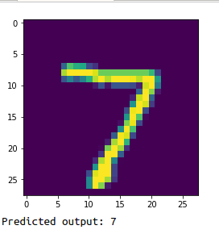
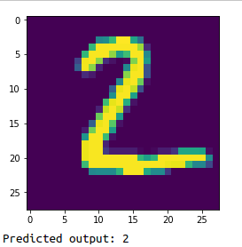
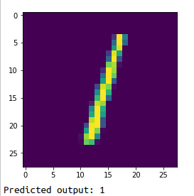
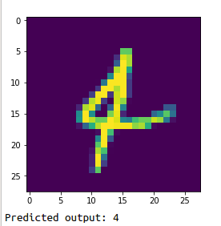
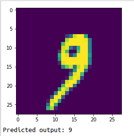
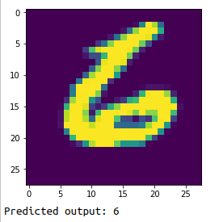

# HANDWRITTEN DIGIT RECOGNITION USING DEEP LEARNING

A deep learning project using convolutional neural networks to classify handwritten digits.The neural network consists of one input
layer,two hidden layers and one output layer.

## REQUIREMENTS

- Python 3.5+
- Numpy
- Matplotlib
- Lasagne
- Theano

## DATASET:

MNIST data set is used in this project

## ACCURACY USING DEEP NEURAL NETWORKS:

Accuracy=91.8%

## TEST IMAGES CLASSIFICATION OUTPUT:
 

